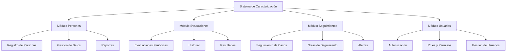
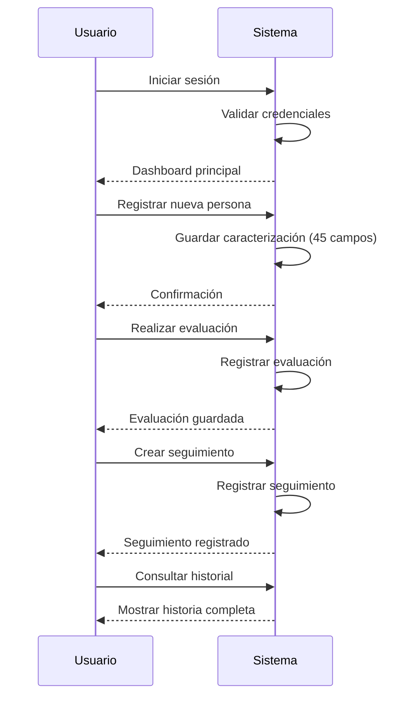

# Plan Arquitectura - Sistema de Caracterización y Seguimiento

## 1. Visión General del Sistema

Sistema web para caracterización de personas con seguimiento y control, desarrollado en CodeIgniter 4.

### Módulos Principales



---

## 2. Arquitectura de Base de Datos

### 2.1 Tabla: personas (Caracterización)

| Campo | Tipo | Descripción |
|-------|------|-------------|
| id | INT (PK) | ID autoincremental |
| numero | VARCHAR(20) | Número de registro |
| nacionalidad | VARCHAR(50) | Nacionalidad |
| cedula | VARCHAR(20) | Número de cédula |
| primer_nombre | VARCHAR(50) | Primer nombre |
| segundo_nombre | VARCHAR(50) | Segundo nombre |
| primer_apellido | VARCHAR(50) | Primer apellido |
| segundo_apellido | VARCHAR(50) | Segundo apellido |
| sexo | ENUM('M','F') | Sexo |
| fecha_nacimiento | DATE | Fecha de nacimiento |
| edad | INT | Edad calculada |
| telefono1 | VARCHAR(20) | Teléfono principal |
| correo_electronico | VARCHAR(100) | Email |
| carrera | VARCHAR(100) | Carrera que estudia |
| ano_semestre | VARCHAR(20) | Período académico |
| posee_beca | ENUM('S','N') | ¿Tiene beca? |
| sede | VARCHAR(100) | Sede universitaria |
| estado | VARCHAR(50) | Estado de residencia |
| siglas_universidad | VARCHAR(20) | Siglas de universidad |
| tipo_ieu | ENUM('PUBLICA','PRIVADA') | Tipo de institución |
| nivel_academico | ENUM('PREGRADO','POSTGRADO') | Nivel |
| urbanismo | VARCHAR(100) | Urbanización |
| municipio | VARCHAR(50) | Municipio |
| parroquia | VARCHAR(50) | Parroquia |
| tiene_hijos | ENUM('S','N') | ¿Tiene hijos? |
| cantidad_hijos | INT | Cantidad de hijos |
| posee_discapacidad | ENUM('S','N') | ¿Tiene discapacidad? |
| descripcion_discapacidad | TEXT | Descripción de discapacidad |
| presenta_enfermedad | ENUM('S','N') | ¿Presenta enfermedad? |
| condicion_medica | TEXT | Condición médica |
| medicamentos | TEXT | Medicamentos que consume |
| trabaja | ENUM('S','N') | ¿Trabaja? |
| tipo_empleo | VARCHAR(50) | Tipo de empleo |
| medio_transporte | VARCHAR(50) | Medio de transporte |
| inscrito_cne | ENUM('S','N') | ¿Inscrito en CNE? |
| centro_electoral | VARCHAR(100) | Centro electoral |
| comuna | VARCHAR(50) | Comuna |
| estado_civil | ENUM('CASADO','SOLTERO','OTRO') | Estado civil |
| talla_camisa | VARCHAR(10) | Talla camisa |
| talla_zapatos | VARCHAR(10) | Talla zapatos |
| talla_pantalon | VARCHAR(10) | Talla pantalón |
| altura | VARCHAR(10) | Altura |
| peso | VARCHAR(10) | Peso |
| tipo_sangre | VARCHAR(5) | Tipo de sangre |
| carga_familiar | INT | Carga familiar |
| fotos | VARCHAR(255) | Ruta de fotos |
| fecha_registro | DATETIME | Fecha de registro |
| estado_registro | ENUM('ACTIVO','INACTIVO') | Estado |
| usuario_registro | INT | ID del usuario que registró |
| created_at | DATETIME | Fecha de creación |
| updated_at | DATETIME | Fecha de actualización |

### 2.2 Tabla: evaluaciones

| Campo | Tipo | Descripción |
|-------|------|-------------|
| id | INT (PK) | ID autoincremental |
| persona_id | INT (FK) | Referencia a persona |
| tipo_evaluacion | VARCHAR(50) | Tipo de evaluación |
| fecha_evaluacion | DATE | Fecha de evaluación |
| resultado | TEXT | Resultado/Observaciones |
| evaluador_id | INT (FK) | Usuario que evaluó |
| created_at | DATETIME | Fecha de creación |
| updated_at | DATETIME | Fecha de actualización |

### 2.3 Tabla: seguimientos

| Campo | Tipo | Descripción |
|-------|------|-------------|
| id | INT (PK) | ID autoincremental |
| persona_id | INT (FK) | Referencia a persona |
| fecha_seguimiento | DATE | Fecha de seguimiento |
| tipo_seguimiento | VARCHAR(50) | Tipo de seguimiento |
| descripcion | TEXT | Descripción/Notas |
| acciones | TEXT | Acciones tomadas |
| proxima_fecha | DATE | Fecha próximo seguimiento |
| usuario_seguimiento | INT (FK) | Usuario responsable |
| created_at | DATETIME | Fecha de creación |
| updated_at | DATETIME | Fecha de actualización |

### 2.4 Tabla: usuarios

| Campo | Tipo | Descripción |
|-------|------|-------------|
| id | INT (PK) | ID autoincremental |
| username | VARCHAR(50) | Nombre de usuario |
| email | VARCHAR(100) | Email |
| password | VARCHAR(255) | Contraseña hash |
| rol | ENUM('ADMIN','EVALUADOR','CONSULTA') | Rol |
| estado | ENUM('ACTIVO','INACTIVO') | Estado |
| created_at | DATETIME | Fecha de creación |
| updated_at | DATETIME | Fecha de actualización |

---

## 3. Estructura de Archivos CodeIgniter 4

```
app/
├── Controllers/
│   ├── PersonaController.php      # CRUD Personas
│   ├── EvaluacionController.php    # Gestión Evaluaciones
│   ├── SeguimientoController.php   # Gestión Seguimientos
│   ├── UsuarioController.php       # Gestión Usuarios
│   ├── AuthController.php          # Login/Logout
│   └── HomeController.php          # Dashboard
├── Models/
│   ├── PersonaModel.php
│   ├── EvaluacionModel.php
│   ├── SeguimientoModel.php
│   └── UsuarioModel.php
├── Views/
│   ├── personas/
│   │   ├── index.php               # Listado
│   │   ├── create.php              # Crear
│   │   ├── edit.php                # Editar
│   │   └── show.php                # Ver detalle
│   ├── evaluaciones/
│   ├── seguimientos/
│   ├── usuarios/
│   ├── auth/
│   └── layout/
│       ├── header.php
│       ├── footer.php
│       └── sidebar.php
├── Config/
│   └── Routes.php                  # Rutas del sistema
└── Database/
    └── Migrations/
        └── (archivos de migración)
```

---

## 4. Flujo de Uso del Sistema



---

## 5. Pendientes de Implementación

- [ ] Revisar y aprobar esta arquitectura
- [ ] Confirmar si hay más campos requeridos
- [ ] Definir tipos de evaluaciones y seguimientos
- [ ] Iniciar implementación en modo Code